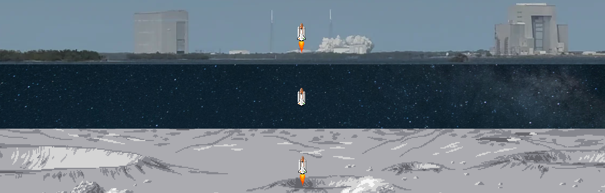
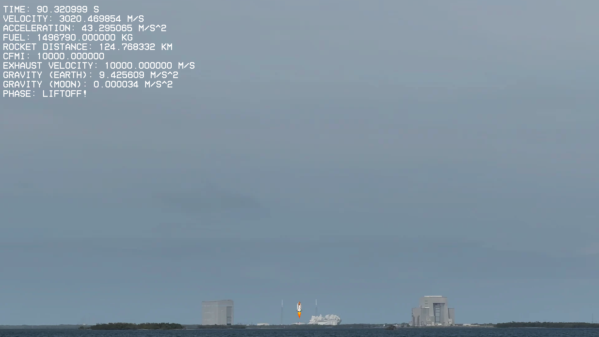
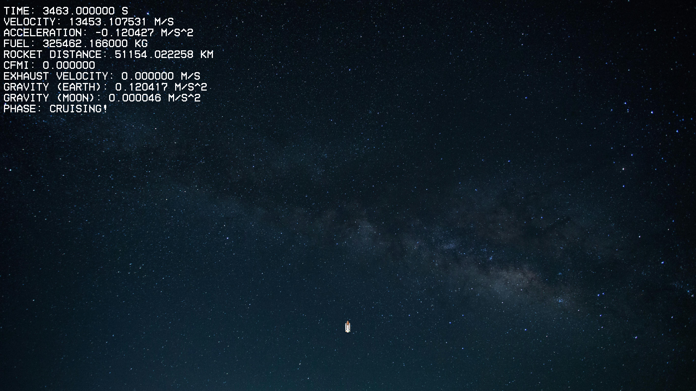
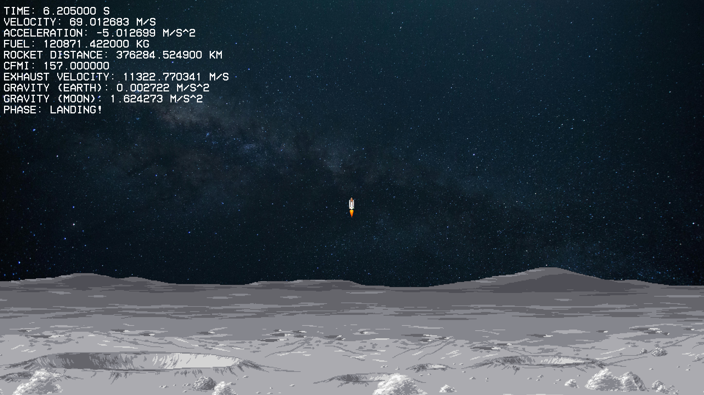

# 🚀 Rocket Simulation: Earth to Moon Physics Engine



A 1-dimentional physics-based simulation of a rocket journey from Earth to the Moon using C++ and SFML. This project simulates rocket thrust, gravitational pull from both Earth and Moon, fuel consumption, and a staged flight sequence with live stats and animated visuals.

---

## 🎯 Features

* **Four-Phase Rocket Simulation**

  * 🚀 **Liftoff**: Accelerate from Earth
  * 🌌 **Cruise**: Drift through space
  * 🛬 **Deceleration**: Prepare for lunar approach
  * 🌑 **Landing**: Controlled touchdown on the Moon

* **Physics Accuracy**

  * Dual gravity (Earth & Moon)
  * Thrust, mass-based acceleration
  * Dynamic exhaust velocity, fuel mass loss

* **Real-Time Display**

  * Velocity, acceleration, fuel remaining
  * Gravity values from both bodies
  * Current phase of flight

* **Modular Codebase**

  * `main.cpp` simplified and clean (\~330 LOC)
  * Encapsulated classes for rendering, physics, data, etc.

* **Custom Assets**

  * Rocket sprite hand-drawn by the Me 😉
  * Phase-specific backgrounds

---

## 📸 Screenshots

| Liftoff Phase                | Cruise Phase                | Moon Landing                 |
| ---------------------------- | --------------------------- | ---------------------------- |
|  |  |  |

---

## 🛠️ Setup & Build

### Requirements

* C++17 compatible compiler
* SFML 2.6.2 (Windows build with MinGW)

### Folder Structure

```
/rocket-sim/
├── assets/        # Fonts, sprites, backgrounds
├── src/           # All source/header files
├── app/           # Compiled executable & DLLs
├── screenshots/   # Images for README
├── Makefile
└── README.md
```

### Build Commands

```bash
make all        # Compile, add icon, link, and run
make compile    # Just compile to object files
make icon       # Add application icon
make link       # Link object files to app.exe
make run        # Run the simulation
make clean      # Remove all object files
```

---

## 🎨 Artwork & Assets

* **Rocket Sprite**: Created by me 🧑‍🎨
* **Fonts & Backgrounds**: From free-use collections

Feel free to replace assets in the `assets/` folder to customize your simulation look.

---

## ✨ Fun Extras

* `Spacebar`: Pause/resume the simulation
* `Escape`: Instantly close the window

---

## 📈 Future Enhancements (Wishlist)

* Audio: Add sound FX and BGM
* Interactive controls: Throttle, steering
* Orbital mechanics: Realistic gravitational pull vectors
* Linux/macOS support via CMake

---

## 🤝 Credits & Inspiration

This simulation was created for my Applied Optimization group project and passion for game development. A great way to explore optimization, physics, and real-time rendering. </br>
Special thanks to [Mohit Mahapatra](https://github.com/exocrat), [Swarnim Chavan](https://github.com/ghostofgen7), [Sarweshwar Pandey](https://github.com/sarweshwarpandey) for their contributions.

**Made with ❤️ by Aditya**

[](https://github.com/kyuuaditya/rocket-sim)

---

> If you liked this, consider starring the repo or sharing it. Feedback and suggestions are always welcome!
